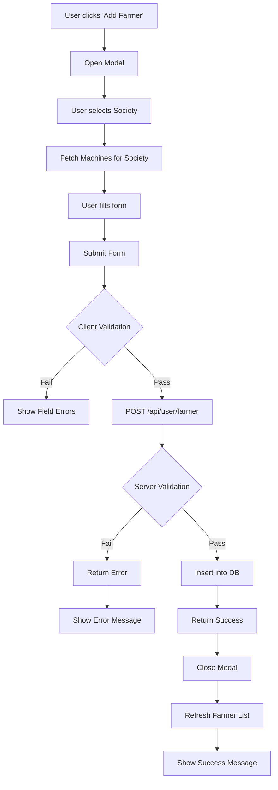

# Farmer Management System - Detailed Technical Analysis

**Document Version**: 1.0.0  
**Analysis Date**: November 5, 2025  
**Status**: ✅ Production Ready  
**Complexity Level**: Advanced

---

## 📑 Table of Contents

1. [System Overview](#system-overview)
2. [Architecture & Design](#architecture--design)
3. [Database Schema](#database-schema)
4. [API Endpoints](#api-endpoints)
5. [Frontend Implementation](#frontend-implementation)
6. [Data Flow & Business Logic](#data-flow--business-logic)
7. [Features Deep Dive](#features-deep-dive)
8. [Security & Validation](#security--validation)
9. [Performance Optimization](#performance-optimization)
10. [Error Handling](#error-handling)
11. [User Experience](#user-experience)
12. [Integration Points](#integration-points)

---

## 🎯 System Overview

### Purpose
The Farmer Management System is the core entity management module for the PSR-v4 application, enabling admins to manage farmer data across multiple societies with comprehensive CRUD operations, bulk operations, and advanced filtering capabilities.

### Key Stakeholders
- **Primary Users**: Admin role users
- **Data Consumers**: Society managers, BMC operators, Dairy managers
- **Integration Systems**: Machine management, Society management, External APIs

### Technical Stack
```typescript
Frontend:
- Next.js 15 (App Router)
- React 19 with TypeScript
- Tailwind CSS + Material Design 3
- Custom Reusable Components

Backend:
- Next.js API Routes (Edge Functions)
- Node.js Runtime
- MySQL Database (Azure)
- Sequelize ORM (Raw Queries)

Security:
- JWT Authentication
- Role-based Authorization
- SQL Injection Protection
- XSS Prevention
```

---

## 🏗️ Architecture & Design

### Multi-Tenant Architecture

The system implements a **schema-per-admin** multi-tenancy model:

```typescript
// Schema naming convention
const schemaName = `${cleanAdminName}_${dbKey.toLowerCase()}`;
// Example: johnsmith_abc123

// Data isolation
- Each admin has dedicated database schema
- Complete data isolation between admins
- No cross-admin data visibility
- Independent schema management
```

### Component Architecture

```
┌─────────────────────────────────────────────────────┐
│           Farmer Management Page                     │
│         (src/app/admin/farmer/page.tsx)             │
└──────────────────┬──────────────────────────────────┘
                   │
         ┌─────────┴─────────┐
         │                   │
    ┌────▼────┐        ┌────▼────┐
    │  UI     │        │ State   │
    │ Layer   │        │ Mgmt    │
    └────┬────┘        └────┬────┘
         │                  │
         └────────┬─────────┘
                  │
         ┌────────▼────────┐
         │   API Routes    │
         │ (Route Handlers)│
         └────────┬────────┘
                  │
         ┌────────▼────────┐
         │   Database      │
         │ (Admin Schema)  │
         └─────────────────┘
```

### State Management Pattern

```typescript
// Core state management approach
const FarmerManagement = () => {
  // Data state
  const [farmers, setFarmers] = useState<Farmer[]>([]);
  const [societies, setSocieties] = useState<Society[]>([]);
  const [machines, setMachines] = useState<Machine[]>([]);
  
  // UI state
  const [loading, setLoading] = useState(true);
  const [showAddForm, setShowAddForm] = useState(false);
  const [selectedFarmer, setSelectedFarmer] = useState<Farmer | null>(null);
  
  // Filter state
  const [statusFilter, setStatusFilter] = useState<'all' | Status>('all');
  const [societyFilter, setSocietyFilter] = useState<string>('all');
  const [machineFilter, setMachineFilter] = useState<string>('all');
  const [searchQuery, setSearchQuery] = useState<string>('');
  
  // Bulk operation state
  const [selectedFarmers, setSelectedFarmers] = useState<Set<number>>(new Set());
  const [selectAll, setSelectAll] = useState(false);
  
  // Form state
  const [formData, setFormData] = useState<FormData>(initialFormData);
  const [fieldErrors, setFieldErrors] = useState<Record<string, string>>({});
  
  // Feedback state
  const [error, setError] = useState('');
  const [success, setSuccess] = useState('');
}
```

---

## 💾 Database Schema

### Farmers Table Structure

```sql
CREATE TABLE farmers (
  -- Primary identification
  id INT AUTO_INCREMENT PRIMARY KEY,
  farmer_id VARCHAR(50) NOT NULL UNIQUE,
  rf_id VARCHAR(50) UNIQUE,  -- Optional RFID tag
  
  -- Personal information
  name VARCHAR(255) NOT NULL,
  password VARCHAR(255) NOT NULL DEFAULT '12345678',
  phone VARCHAR(15),
  address TEXT,
  
  -- Communication & Financial
  sms_enabled ENUM('ON', 'OFF') DEFAULT 'OFF' NOT NULL,
  bonus DECIMAL(10, 2) DEFAULT 0.00 NOT NULL,
  
  -- Banking details
  bank_name VARCHAR(255),
  bank_account_number VARCHAR(50),
  ifsc_code VARCHAR(11),
  
  -- Relationships
  society_id INT,  -- Foreign key to societies table
  machine_id INT,  -- Foreign key to machines table
  
  -- Status management
  status ENUM('active', 'inactive', 'suspended', 'maintenance') 
         DEFAULT 'active' NOT NULL,
  
  -- Additional information
  notes TEXT,
  cattle_count INT,  -- Number of cattle owned
  
  -- Timestamps
  created_at TIMESTAMP DEFAULT CURRENT_TIMESTAMP NOT NULL,
  updated_at TIMESTAMP DEFAULT CURRENT_TIMESTAMP 
             ON UPDATE CURRENT_TIMESTAMP NOT NULL,
  
  -- Indexes for performance
  INDEX idx_farmer_id (farmer_id),
  INDEX idx_rf_id (rf_id),
  INDEX idx_society_id (society_id),
  INDEX idx_machine_id (machine_id),
  INDEX idx_status (status),
  
  -- Foreign keys (defined per schema)
  FOREIGN KEY (society_id) REFERENCES societies(id) ON DELETE SET NULL,
  FOREIGN KEY (machine_id) REFERENCES machines(id) ON DELETE SET NULL
);
```

### Data Model Interface

```typescript
interface Farmer {
  // Database fields
  id: number;
  farmerId: string;              // Unique identifier
  rfId?: string;                 // RFID tag (optional)
  farmerName: string;            // Full name
  password?: string;             // Default: '12345678'
  contactNumber?: string;        // Phone number
  smsEnabled: 'ON' | 'OFF';      // SMS notification preference
  bonus: number;                 // Bonus amount
  address?: string;              // Physical address
  
  // Banking information
  bankName?: string;
  bankAccountNumber?: string;
  ifscCode?: string;
  
  // Relationships
  societyId?: number;            // Link to society
  societyName?: string;          // Populated via JOIN
  societyIdentifier?: string;    // Society code
  machineId?: number;            // Assigned machine
  machineName?: string;          // Machine ID
  machineType?: string;          // Machine type
  
  // Status & metadata
  status: 'active' | 'inactive' | 'suspended' | 'maintenance';
  notes?: string;
  cattleCount?: number;
  createdAt: string;
  updatedAt?: string;
}
```

### Database Constraints

```sql
-- Uniqueness constraints
- farmer_id: UNIQUE across schema (each admin)
- rf_id: UNIQUE globally (when provided)

-- Required fields
- farmer_id: NOT NULL
- name: NOT NULL
- sms_enabled: NOT NULL (default 'OFF')
- bonus: NOT NULL (default 0.00)
- status: NOT NULL (default 'active')

-- Optional relationships
- society_id: Can be NULL (orphan farmers allowed)
- machine_id: Can be NULL (unassigned farmers allowed)
```

---

## 🔌 API Endpoints

### 1. GET /api/user/farmer

**Purpose**: Retrieve farmer(s) data

**Authentication**: Required (JWT)  
**Authorization**: Admin role only

**Query Parameters**:
```typescript
?id=123                    // Single farmer by ID
// OR no params            // All farmers
```

**Response Format**:
```typescript
{
  success: true,
  message: "Farmers retrieved successfully",
  data: [
    {
      id: 1,
      farmerId: "F001",
      rfId: "RF001",
      farmerName: "John Doe",
      contactNumber: "9876543210",
      smsEnabled: "ON",
      bonus: 1500.00,
      address: "123 Main St, Village",
      bankName: "State Bank",
      bankAccountNumber: "1234567890",
      ifscCode: "SBIN0001234",
      societyId: 5,
      societyName: "Green Valley Dairy",
      societyIdentifier: "GVD001",
      machineId: 3,
      machineName: "M2232",
      machineType: "AMCUPro",
      status: "active",
      notes: "Premium farmer",
      cattleCount: 5,
      createdAt: "2025-11-05T10:30:00.000Z",
      updatedAt: "2025-11-05T15:45:00.000Z"
    }
  ]
}
```

**SQL Query Logic**:
```sql
-- Joins with societies and machines for complete data
SELECT 
  f.id, f.farmer_id, f.rf_id, f.name, f.password, 
  f.phone, f.sms_enabled, f.bonus, f.address, 
  f.bank_name, f.bank_account_number, f.ifsc_code, 
  f.society_id, f.machine_id, f.status, f.notes, 
  f.cattle_count, f.created_at, f.updated_at,
  s.name as society_name, 
  s.society_id as society_identifier,
  m.machine_id as machine_name, 
  m.machine_type
FROM `{schemaName}`.farmers f
LEFT JOIN `{schemaName}`.societies s ON f.society_id = s.id
LEFT JOIN `{schemaName}`.machines m ON f.machine_id = m.id
WHERE f.id = ? -- If single farmer
ORDER BY f.created_at DESC
```

---

### 2. POST /api/user/farmer

**Purpose**: Create new farmer (single or bulk)

**Authentication**: Required (JWT)  
**Authorization**: Admin role only

**Request Body - Single Farmer**:
```typescript
{
  farmerId: "F001",              // Required
  rfId: "RF001",                 // Optional
  farmerName: "John Doe",        // Required
  password: "custom123",         // Optional (default: 12345678)
  contactNumber: "9876543210",   // Optional
  smsEnabled: "ON",              // Optional (default: OFF)
  bonus: 1500,                   // Optional (default: 0)
  address: "123 Main St",        // Optional
  bankName: "State Bank",        // Optional
  bankAccountNumber: "123...",   // Optional
  ifscCode: "SBIN0001234",       // Optional
  societyId: 5,                  // Required in UI validation
  machineId: 3,                  // Required in UI validation
  status: "active",              // Optional (default: active)
  notes: "Premium farmer"        // Optional
}
```

**Request Body - Bulk Upload**:
```typescript
{
  farmers: [
    {
      farmerId: "F001",
      farmerName: "John Doe",
      // ... same fields as above
    },
    {
      farmerId: "F002",
      farmerName: "Jane Smith",
      // ...
    }
  ]
}
```

**Validation Rules**:
```typescript
// Server-side validation
1. farmerId: Required, unique per schema
2. farmerName: Required, min 2 characters
3. rfId: Optional, unique globally (if provided)
4. societyId: Validated as number, must exist
5. machineId: Validated as number, must exist
6. bonus: Numeric, >= 0
7. smsEnabled: Must be 'ON' or 'OFF'
8. status: Must be valid enum value
```

**Response**:
```typescript
{
  success: true,
  message: "Farmer created successfully",
  data: null
}

// OR for bulk
{
  success: true,
  message: "Successfully uploaded 25 farmers",
  data: null
}
```

**Error Responses**:
```typescript
// Duplicate farmer_id
{
  success: false,
  error: "Farmer ID already exists",
  statusCode: 400
}

// Duplicate rf_id
{
  success: false,
  error: "Farmer ID or RF-ID already exists",
  statusCode: 400
}

// Missing required fields
{
  success: false,
  error: "Farmer ID and name are required",
  statusCode: 400
}
```

---

### 3. PUT /api/user/farmer

**Purpose**: Update existing farmer

**Authentication**: Required (JWT)  
**Authorization**: Admin role only

**Request Body**:
```typescript
{
  id: 123,                       // Required - farmer DB ID
  farmerId: "F001",              // Required
  rfId: "RF001",                 // Optional
  farmerName: "John Doe Updated", // Required
  // ... all other fields same as POST
}
```

**Validation**:
- All fields from POST endpoint
- id: Must exist in database
- farmerId: Can be changed, but must remain unique

**SQL Query**:
```sql
UPDATE `{schemaName}`.farmers 
SET 
  farmer_id = ?, 
  rf_id = ?, 
  name = ?, 
  password = ?, 
  phone = ?,
  sms_enabled = ?, 
  bonus = ?, 
  address = ?, 
  bank_name = ?,
  bank_account_number = ?, 
  ifsc_code = ?, 
  society_id = ?,
  machine_id = ?, 
  status = ?, 
  notes = ?, 
  updated_at = CURRENT_TIMESTAMP
WHERE id = ?
```

**Response**:
```typescript
{
  success: true,
  message: "Farmer updated successfully",
  data: null
}
```

---

### 4. DELETE /api/user/farmer

**Purpose**: Delete farmer(s)

**Authentication**: Required (JWT)  
**Authorization**: Admin role only

**Query Parameters**:
```typescript
// Single delete
?id=123

// Bulk delete
?ids=[123,124,125]
```

**SQL Queries**:
```sql
-- Single delete
DELETE FROM `{schemaName}`.farmers WHERE id = ?

-- Bulk delete
DELETE FROM `{schemaName}`.farmers WHERE id IN (?, ?, ?)
```

**Response - Single**:
```typescript
{
  success: true,
  message: "Farmer deleted successfully",
  data: null
}
```

**Response - Bulk**:
```typescript
{
  success: true,
  message: "Successfully deleted 3 farmers",
  data: null
}
```

**Error Handling**:
```typescript
// Farmer not found
{
  success: false,
  error: "Farmer not found",
  statusCode: 404
}

// Some farmers not found (bulk)
{
  success: false,
  error: "One or more farmers not found",
  statusCode: 404
}
```

---

### 5. POST /api/user/farmer/upload

**Purpose**: CSV bulk upload with advanced validation

**Authentication**: Required (JWT)  
**Authorization**: Admin role only

**Request Type**: `multipart/form-data`

**Form Fields**:
```typescript
{
  file: File,              // CSV file
  societyId: string,       // Default society for farmers without society_id
  machineId: string        // Default machine for farmers without machine_id
}
```

**CSV Format**:
```csv
ID,RF-ID,NAME,MOBILE,SMS,BONUS,MACHINE-ID
F001,RF001,John Doe,9876543210,ON,1500,
F002,RF002,Jane Smith,9876543211,OFF,2000,3
F003,,Bob Johnson,9876543212,ON,1000,
```

**CSV Headers**:
- **Required**: ID, RF-ID, NAME, MOBILE, SMS, BONUS
- **Optional**: MACHINE-ID

**Processing Logic**:
```typescript
1. Validate file type (.csv only)
2. Parse CSV headers and validate format
3. Validate each row:
   - Required fields present
   - Correct number of columns
   - Data type validation
4. Check for duplicate farmer_id in CSV
5. Check for duplicate rf_id globally
6. Insert farmers in batch with transaction safety
7. Handle partial success scenarios
8. Return detailed error report
```

**Response**:
```typescript
{
  success: true,
  message: "Successfully imported 48 out of 50 farmers. 2 farmers failed to import.",
  data: {
    totalProcessed: 50,
    successCount: 48,
    failedCount: 2,
    failedFarmers: [
      {
        row: 15,
        farmerId: "F014",
        name: "Duplicate Farmer",
        error: "Farmer ID 'F014' already exists in society 5"
      },
      {
        row: 32,
        farmerId: "F031",
        name: "Invalid RFID",
        error: "RF-ID 'RF999' already exists globally"
      }
    ]
  }
}
```

**Error Scenarios**:
```typescript
// Invalid file type
"Only CSV files are allowed"

// Missing headers
"Missing required CSV headers: NAME, BONUS"

// Invalid headers
"Invalid CSV headers: EXTRA_FIELD. Valid: ID, RF-ID, NAME..."

// Empty file
"CSV file must contain header and at least one data row"

// Missing required data
"Row 5: ID and NAME are required"
```

---

## 🎨 Frontend Implementation

### Page Structure (`page.tsx`)

**Total Lines**: 1,802 lines  
**File Path**: `src/app/admin/farmer/page.tsx`

#### Component Breakdown

```typescript
// Main component structure
const FarmerManagement = () => {
  // ===== STATE MANAGEMENT (Lines 1-110) =====
  // Data state, UI state, filter state, form state
  
  // ===== EFFECTS & CALLBACKS (Lines 111-250) =====
  useEffect(() => {
    fetchFarmers();
    fetchSocieties();
    fetchMachines();
  }, []);
  
  useEffect(() => {
    // Global search event listener
    const handleGlobalSearch = (e: CustomEvent) => {
      setSearchQuery(e.detail.query);
    };
    
    window.addEventListener('globalSearch', handleGlobalSearch);
    return () => window.removeEventListener('globalSearch', handleGlobalSearch);
  }, []);
  
  // ===== DATA FETCHING (Lines 251-400) =====
  const fetchFarmers = async () => { /* ... */ };
  const fetchSocieties = async () => { /* ... */ };
  const fetchMachines = async () => { /* ... */ };
  const fetchMachinesBySociety = async (societyId) => { /* ... */ };
  
  // ===== CRUD OPERATIONS (Lines 401-750) =====
  const handleAddSubmit = async (e) => { /* ... */ };
  const handleEditSubmit = async (e) => { /* ... */ };
  const handleDelete = async (id) => { /* ... */ };
  const handleStatusChange = async (id, newStatus) => { /* ... */ };
  
  // ===== BULK OPERATIONS (Lines 751-950) =====
  const handleSelectFarmer = (id) => { /* ... */ };
  const handleSelectAll = () => { /* ... */ };
  const handleBulkDelete = async () => { /* ... */ };
  const handleBulkStatusUpdate = async () => { /* ... */ };
  
  // ===== CSV OPERATIONS (Lines 951-1050) =====
  const handleBulkUpload = async (e) => { /* ... */ };
  const handleDownload = async (format) => { /* ... */ };
  const handleDownloadWithColumns = async (format, columns) => { /* ... */ };
  
  // ===== COMPUTED VALUES (Lines 1051-1150) =====
  const filteredFarmers = useMemo(() => {
    return farmers.filter(farmer => {
      const statusMatch = statusFilter === 'all' || farmer.status === statusFilter;
      const societyMatch = societyFilter === 'all' || 
                          farmer.societyId?.toString() === societyFilter;
      const machineMatch = machineFilter === 'all' || 
                          (machineFilter === 'unassigned' && !farmer.machineId) ||
                          farmer.machineId?.toString() === machineFilter;
      const searchMatch = searchQuery === '' || 
                         /* multi-field search logic */;
      return statusMatch && societyMatch && machineMatch && searchMatch;
    });
  }, [farmers, statusFilter, societyFilter, machineFilter, searchQuery]);
  
  // ===== RENDER (Lines 1151-1802) =====
  return (
    <div className="p-3 xs:p-4 sm:p-6 lg:p-8">
      {/* Header */}
      {/* Stats Cards */}
      {/* Filter Controls */}
      {/* Bulk Actions */}
      {/* Farmer Cards/List */}
      {/* Modals */}
    </div>
  );
};
```

---

### UI Components Used

#### 1. Stats Cards (Lines 1060-1115)
```tsx
<div className="grid grid-cols-2 xs:grid-cols-3 lg:grid-cols-5 gap-2 sm:gap-3">
  <StatsCard title="Total" value={farmers.length} icon={<Users />} color="green" />
  <StatsCard title="Active" value={activeCount} icon={<UserCheck />} color="green" />
  <StatsCard title="Inactive" value={inactiveCount} icon={<UserX />} color="red" />
  <StatsCard title="Suspended" value={suspendedCount} icon={<AlertTriangle />} color="yellow" />
  <StatsCard title="Maintenance" value={maintenanceCount} icon={<AlertTriangle />} color="blue" />
</div>
```

**Responsive Behavior**:
- Mobile (< 475px): 2 columns
- Small (475px - 1024px): 3 columns
- Large (≥ 1024px): 5 columns

---

#### 2. Filter Controls (Lines 1116-1250)
```tsx
<div className="grid grid-cols-1 xs:grid-cols-2 lg:grid-cols-4 gap-2 sm:gap-3">
  {/* Status Filter */}
  <select value={statusFilter} onChange={...}>
    <option value="all">All Status</option>
    <option value="active">Active</option>
    <option value="inactive">Inactive</option>
    <option value="suspended">Suspended</option>
    <option value="maintenance">Maintenance</option>
  </select>
  
  {/* Society Filter */}
  <select value={societyFilter} onChange={...}>
    <option value="all">All Societies</option>
    {societies.map(s => (
      <option key={s.id} value={s.id}>{s.name}</option>
    ))}
  </select>
  
  {/* Machine Filter */}
  <select value={machineFilter} onChange={...}>
    <option value="all">All Machines</option>
    <option value="unassigned">Unassigned</option>
    {machines.map(m => (
      <option key={m.id} value={m.id}>{m.machineId}</option>
    ))}
  </select>
  
  {/* Clear Filters Button */}
  <button onClick={clearAllFilters}>Clear All</button>
</div>
```

**Filter Interaction Logic**:
```typescript
// Machine filter updates based on society selection
useEffect(() => {
  if (societyFilter !== 'all') {
    fetchMachinesBySociety(societyFilter);
  } else {
    fetchMachines(); // All machines
  }
}, [societyFilter]);

// Auto-clear selections when filters change
useEffect(() => {
  if (selectedFarmers.size > 0) {
    const visibleIds = new Set(filteredFarmers.map(f => f.id));
    const updatedSelection = new Set(
      Array.from(selectedFarmers).filter(id => visibleIds.has(id))
    );
    setSelectedFarmers(updatedSelection);
  }
}, [statusFilter, societyFilter, machineFilter, searchQuery]);
```

---

#### 3. Farmer Cards (Lines 1251-1450)

```tsx
{loading ? (
  <FlowerSpinner size={64} text="Loading farmers..." />
) : filteredFarmers.length === 0 ? (
  <EmptyState
    title="No Farmers Found"
    description="Start by adding your first farmer or adjust your filters"
    icon={<Users className="w-16 h-16" />}
    actionLabel="Add Farmer"
    onAction={openAddModal}
  />
) : (
  <div className="grid grid-cols-1 md:grid-cols-2 lg:grid-cols-3 gap-4">
    {filteredFarmers.map(farmer => (
      <ItemCard
        key={farmer.id}
        item={farmer}
        type="farmer"
        onEdit={() => handleEdit(farmer)}
        onDelete={() => handleDelete(farmer.id)}
        onStatusChange={(status) => handleStatusChange(farmer.id, status)}
        selected={selectedFarmers.has(farmer.id)}
        onSelect={() => handleSelectFarmer(farmer.id)}
        searchQuery={searchQuery}
        highlightFields={[
          'farmerName', 'farmerId', 'rfId', 'contactNumber',
          'societyName', 'address', 'bankName', 'bankAccountNumber'
        ]}
      />
    ))}
  </div>
)}
```

**Card Features**:
- Checkbox for bulk selection
- Status dropdown (inline update)
- Edit button → Opens edit modal
- Delete button → Confirmation dialog
- Click → Navigate to detail page
- Search highlighting on matched fields
- Responsive 1-2-3 column grid

---

#### 4. Add/Edit Farmer Modal (Lines 1336-1650)

```tsx
<FormModal
  isOpen={showAddForm}
  onClose={closeAddModal}
  title="Add New Farmer"
>
  <form onSubmit={handleAddSubmit} className="space-y-4 sm:space-y-6">
    <FormGrid>
      {/* Required Fields */}
      <FormInput
        label="Farmer ID"
        value={formData.farmerId}
        onChange={(value) => setFormData({...formData, farmerId: value})}
        placeholder="Enter unique farmer ID (e.g., F001)"
        required
        error={fieldErrors.farmerId}
      />
      
      <FormInput
        label="Farmer Name"
        value={formData.farmerName}
        onChange={(value) => setFormData({...formData, farmerName: value})}
        placeholder="Enter farmer's full name"
        required
        error={fieldErrors.farmerName}
      />
      
      <FormSelect
        label="Society"
        value={formData.societyId}
        onChange={(value) => {
          setFormData({...formData, societyId: value, machineId: ''});
          fetchMachinesBySociety(value);
        }}
        options={societies.map(s => ({
          value: s.id.toString(),
          label: `${s.name} (${s.society_id})`
        }))}
        required
      />
      
      <FormSelect
        label="Machine"
        value={formData.machineId}
        onChange={(value) => setFormData({...formData, machineId: value})}
        options={machines.map(m => ({
          value: m.id.toString(),
          label: `${m.machineId} - ${m.machineType}`
        }))}
        required
        disabled={!formData.societyId || machinesLoading}
        loading={machinesLoading}
      />
      
      {/* Optional Fields */}
      <FormInput label="RF-ID" value={formData.rfId} onChange={...} />
      <FormInput label="Contact Number" value={formData.contactNumber} onChange={...} />
      <FormSelect
        label="SMS Enabled"
        value={formData.smsEnabled}
        options={[
          {value: 'ON', label: 'ON'},
          {value: 'OFF', label: 'OFF'}
        ]}
      />
      <FormInput
        label="Bonus"
        type="number"
        value={formData.bonus}
        onChange={...}
        min={0}
        step={0.01}
      />
      
      {/* Banking Section */}
      <div className="col-span-full">
        <h3 className="text-lg font-medium">Banking Details</h3>
      </div>
      <FormInput label="Bank Name" value={formData.bankName} onChange={...} />
      <FormInput label="Account Number" value={formData.bankAccountNumber} onChange={...} />
      <FormInput label="IFSC Code" value={formData.ifscCode} onChange={...} />
      
      {/* Additional Fields */}
      <FormTextarea
        label="Address"
        value={formData.address}
        onChange={...}
        rows={3}
        className="col-span-full"
      />
      <FormTextarea
        label="Notes"
        value={formData.notes}
        onChange={...}
        rows={3}
        className="col-span-full"
      />
    </FormGrid>
    
    <FormActions
      onCancel={closeAddModal}
      submitText="Create Farmer"
      isLoading={isSubmitting}
      submitType="submit"
    />
  </form>
</FormModal>
```

**Form Validation Logic**:
```typescript
// Client-side validation
const validateForm = () => {
  const errors: Record<string, string> = {};
  
  if (!formData.farmerId?.trim()) {
    errors.farmerId = 'Farmer ID is required';
  }
  
  if (!formData.farmerName?.trim()) {
    errors.farmerName = 'Farmer name is required';
  }
  
  if (!formData.societyId) {
    errors.societyId = 'Society is required';
  }
  
  if (!formData.machineId) {
    errors.machineId = 'Machine is required';
  }
  
  if (formData.bonus < 0) {
    errors.bonus = 'Bonus cannot be negative';
  }
  
  setFieldErrors(errors);
  return Object.keys(errors).length === 0;
};

// Server response error handling
if (!response.ok) {
  const errorData = await response.json();
  const errorMessage = errorData.error || 'Failed to create farmer';
  
  // Map server errors to field errors
  if (errorMessage.includes('Farmer ID') && errorMessage.includes('already exists')) {
    setFieldErrors({ farmerId: 'This Farmer ID already exists' });
  } else if (errorMessage.includes('RF-ID') && errorMessage.includes('already exists')) {
    setFieldErrors({ rfId: 'This RF-ID already exists' });
  } else {
    setError(errorMessage);
  }
}
```

---

#### 5. CSV Upload Modal (Lines 1651-1730)

```tsx
<CSVUploadModal
  isOpen={showCSVUpload}
  onClose={() => setShowCSVUpload(false)}
  onSuccess={(result) => {
    console.log('Upload result:', result);
    fetchFarmers();
    setSuccess('CSV upload completed successfully!');
  }}
  endpoint="/api/user/farmer/upload"
  entityType="farmer"
  societies={societies}
  machines={machines}
  onUploadComplete={() => {
    fetchFarmers();
    setSuccess('CSV upload completed successfully!');
  }}
/>
```

**CSV Upload Modal Features**:
- File selection with drag-and-drop
- Default society selection (required)
- Default machine selection (required)
- CSV format validation
- Upload progress indicator
- Detailed error reporting
- Partial success handling

---

#### 6. Bulk Actions Toolbar (Lines 1251-1300)

```tsx
{selectedFarmers.size > 0 && (
  <div className="bg-blue-50 dark:bg-blue-900/20 border border-blue-200 dark:border-blue-800 rounded-lg p-4">
    <div className="flex flex-col sm:flex-row items-start sm:items-center justify-between gap-3">
      <div className="flex items-center space-x-3">
        <input
          type="checkbox"
          checked={selectAll}
          onChange={handleSelectAll}
          className="w-4 h-4 rounded"
        />
        <span className="font-medium text-gray-900 dark:text-gray-100">
          {selectedFarmers.size} farmer(s) selected
        </span>
      </div>
      
      <div className="flex flex-wrap gap-2">
        {/* Bulk Status Update */}
        <select
          value={bulkStatus}
          onChange={(e) => setBulkStatus(e.target.value as Status)}
          className="px-3 py-2 border rounded-lg"
        >
          <option value="active">Active</option>
          <option value="inactive">Inactive</option>
          <option value="suspended">Suspended</option>
          <option value="maintenance">Maintenance</option>
        </select>
        
        <button
          onClick={handleBulkStatusUpdate}
          className="px-4 py-2 bg-blue-600 text-white rounded-lg"
          disabled={isSubmitting}
        >
          Update Status
        </button>
        
        {/* Bulk Delete */}
        <button
          onClick={() => setShowDeleteConfirm(true)}
          className="px-4 py-2 bg-red-600 text-white rounded-lg"
        >
          <Trash2 className="w-4 h-4 mr-2" />
          Delete Selected
        </button>
      </div>
    </div>
  </div>
)}
```

---

## 🔄 Data Flow & Business Logic

### Complete CRUD Flow

#### 1. CREATE (Add Farmer)



**Code Implementation**:
```typescript
const handleAddSubmit = async (e: React.FormEvent) => {
  e.preventDefault();
  
  // Step 1: Client-side validation
  if (!formData.farmerId?.trim()) {
    setError('Please enter a farmer ID.');
    return;
  }
  
  if (!formData.farmerName?.trim()) {
    setError('Please enter the farmer name.');
    return;
  }
  
  if (!formData.societyId) {
    setError('Please select a society for the farmer.');
    return;
  }
  
  if (!formData.machineId) {
    setError('Please select a machine for the farmer.');
    return;
  }
  
  setIsSubmitting(true);
  
  try {
    // Step 2: API call
    const token = localStorage.getItem('authToken');
    const response = await fetch('/api/user/farmer', {
      method: 'POST',
      headers: {
        'Content-Type': 'application/json',
        Authorization: `Bearer ${token}`
      },
      body: JSON.stringify({
        ...formData,
        societyId: parseInt(formData.societyId),
        bonus: Number(formData.bonus)
      })
    });
    
    // Step 3: Handle response
    if (response.ok) {
      // Success path
      setShowAddForm(false);
      setFormData(initialFormData);
      setSuccess('Farmer created successfully');
      setError('');
      fetchFarmers(); // Refresh list
    } else {
      // Error path
      const errorResponse = await response.json();
      const errorMessage = errorResponse.error || 'Failed to create farmer';
      
      // Map specific errors to fields
      setFieldErrors({});
      
      if (errorMessage.includes('Farmer ID') && errorMessage.includes('already exists')) {
        setFieldErrors({ farmerId: 'This Farmer ID already exists' });
      } else if (errorMessage.includes('farmer name') && errorMessage.includes('already exists')) {
        setFieldErrors({ farmerName: 'This Farmer name already exists' });
      } else {
        setError(errorMessage);
      }
      setSuccess('');
    }
  } catch (error) {
    console.error('Error creating farmer:', error);
    setError('Error creating farmer. Please try again.');
    setSuccess('');
  } finally {
    setIsSubmitting(false);
  }
};
```

---

#### 2. READ (Fetch Farmers)

```typescript
const fetchFarmers = async () => {
  setLoading(true);
  try {
    const token = localStorage.getItem('authToken');
    const response = await fetch('/api/user/farmer', {
      headers: { Authorization: `Bearer ${token}` }
    });
    
    if (response.ok) {
      const data = await response.json();
      setFarmers(data.data || []);
      setError('');
    } else {
      setError('Failed to fetch farmers');
      setFarmers([]);
    }
  } catch (error) {
    console.error('Error fetching farmers:', error);
    setError('Error loading farmers');
    setFarmers([]);
  } finally {
    setLoading(false);
  }
};
```

**Server-side Processing**:
```typescript
// API Route Handler
export async function GET(request: NextRequest) {
  // 1. Authentication
  const token = request.headers.get('authorization')?.replace('Bearer ', '');
  if (!token) return createErrorResponse('Authentication required', 401);
  
  // 2. Authorization
  const payload = verifyToken(token);
  if (!payload || payload.role !== 'admin') {
    return createErrorResponse('Admin access required', 403);
  }
  
  // 3. Get admin's schema
  const admin = await User.findByPk(payload.id);
  if (!admin || !admin.dbKey) {
    return createErrorResponse('Admin not found or database not configured', 404);
  }
  
  const schemaName = `${cleanAdminName}_${admin.dbKey.toLowerCase()}`;
  
  // 4. Execute query with JOINs
  const query = `
    SELECT 
      f.*, 
      s.name as society_name, 
      s.society_id as society_identifier,
      m.machine_id as machine_name, 
      m.machine_type
    FROM \`${schemaName}\`.farmers f
    LEFT JOIN \`${schemaName}\`.societies s ON f.society_id = s.id
    LEFT JOIN \`${schemaName}\`.machines m ON f.machine_id = m.id
    ORDER BY f.created_at DESC
  `;
  
  const [results] = await sequelize.query(query);
  
  // 5. Transform data
  const farmers = results.map(farmer => ({
    id: farmer.id,
    farmerId: farmer.farmer_id,
    farmerName: farmer.name,
    // ... map all fields
  }));
  
  // 6. Return response
  return createSuccessResponse('Farmers retrieved successfully', farmers);
}
```

---

#### 3. UPDATE (Edit Farmer)

```typescript
const handleEditSubmit = async (e: React.FormEvent) => {
  e.preventDefault();
  if (!selectedFarmer) return;
  
  // Validation (same as create)
  
  setIsSubmitting(true);
  
  try {
    const token = localStorage.getItem('authToken');
    const response = await fetch('/api/user/farmer', {
      method: 'PUT',
      headers: {
        'Content-Type': 'application/json',
        Authorization: `Bearer ${token}`
      },
      body: JSON.stringify({
        id: selectedFarmer.id,  // Important: include ID for update
        ...formData,
        societyId: parseInt(formData.societyId),
        bonus: Number(formData.bonus)
      })
    });
    
    if (response.ok) {
      setShowEditForm(false);
      setSelectedFarmer(null);
      setFormData(initialFormData);
      setSuccess('Farmer updated successfully');
      setError('');
      fetchFarmers();
    } else {
      const errorResponse = await response.json();
      setError(errorResponse.error || 'Failed to update farmer');
      setSuccess('');
    }
  } catch (error) {
    console.error('Error updating farmer:', error);
    setError('Error updating farmer. Please try again.');
    setSuccess('');
  } finally {
    setIsSubmitting(false);
  }
};
```

---

#### 4. DELETE (Remove Farmer)

```typescript
// Single delete
const handleDelete = async (id: number) => {
  if (!confirm('Are you sure you want to delete this farmer? This action cannot be undone.')) {
    return;
  }
  
  try {
    const token = localStorage.getItem('authToken');
    const response = await fetch(`/api/user/farmer?id=${id}`, {
      method: 'DELETE',
      headers: { Authorization: `Bearer ${token}` }
    });
    
    if (response.ok) {
      setFarmers(prev => prev.filter(f => f.id !== id));
      setSuccess('Farmer deleted successfully');
      setError('');
    } else {
      setError('Failed to delete farmer. Please try again.');
      setSuccess('');
    }
  } catch (error) {
    console.error('Error deleting farmer:', error);
    setError('Error deleting farmer. Please try again.');
    setSuccess('');
  }
};

// Bulk delete
const handleBulkDelete = async () => {
  if (selectedFarmers.size === 0) return;
  
  setIsDeletingBulk(true);
  try {
    const token = localStorage.getItem('authToken');
    const ids = Array.from(selectedFarmers);
    
    const response = await fetch(
      `/api/user/farmer?ids=${encodeURIComponent(JSON.stringify(ids))}`,
      {
        method: 'DELETE',
        headers: { Authorization: `Bearer ${token}` }
      }
    );
    
    if (response.ok) {
      await fetchFarmers();
      setSelectedFarmers(new Set());
      setSelectAll(false);
      setShowDeleteConfirm(false);
      setSuccess(`Successfully deleted ${ids.length} farmer(s)`);
      setError('');
    } else {
      setError('Failed to delete farmers. Please try again.');
      setSuccess('');
    }
  } catch (error) {
    console.error('Error bulk deleting:', error);
    setError('Error bulk deleting farmers. Please try again.');
    setSuccess('');
  } finally {
    setIsDeletingBulk(false);
  }
};
```

---

### Advanced Search & Filtering

#### Multi-Field Search Implementation

```typescript
const filteredFarmers = useMemo(() => {
  return farmers.filter(farmer => {
    // Status filter
    const statusMatch = statusFilter === 'all' || farmer.status === statusFilter;
    
    // Society filter
    const societyMatch = societyFilter === 'all' || 
                        farmer.societyId?.toString() === societyFilter;
    
    // Machine filter
    const machineMatch = machineFilter === 'all' || 
                        (machineFilter === 'unassigned' && !farmer.machineId) ||
                        farmer.machineId?.toString() === machineFilter;
    
    // Search query (multi-field)
    const searchMatch = searchQuery === '' || [
      farmer.farmerName,
      farmer.farmerId,
      farmer.rfId,
      farmer.contactNumber,
      farmer.societyName,
      farmer.societyIdentifier,
      farmer.machineName,
      farmer.address,
      farmer.bankName,
      farmer.bankAccountNumber,
      farmer.ifscCode,
      farmer.notes
    ].some(field => 
      field?.toLowerCase().includes(searchQuery.toLowerCase())
    );
    
    return statusMatch && societyMatch && machineMatch && searchMatch;
  });
}, [farmers, statusFilter, societyFilter, machineFilter, searchQuery]);
```

#### Search Highlighting

```typescript
const highlightText = (text: string, query: string) => {
  if (!query || !text) return text;
  
  // Escape special regex characters
  const escapedQuery = query.replace(/[.*+?^${}()|[\]\\]/g, '\\$&');
  
  const parts = text.split(new RegExp(`(${escapedQuery})`, 'gi'));
  
  return parts.map((part, i) =>
    part.toLowerCase() === query.toLowerCase() ? (
      <mark key={i} className="bg-yellow-200 dark:bg-yellow-800 px-0.5 rounded">
        {part}
      </mark>
    ) : (
      part
    )
  );
};
```

---

### Bulk Operations Logic

#### Bulk Status Update

```typescript
const handleBulkStatusUpdate = async () => {
  if (selectedFarmers.size === 0) return;
  
  setIsSubmitting(true);
  
  try {
    const token = localStorage.getItem('authToken');
    const selectedFarmersList = farmers.filter(f => selectedFarmers.has(f.id));
    
    // Create update promises for all selected farmers
    const updatePromises = selectedFarmersList.map(farmer =>
      fetch('/api/user/farmer', {
        method: 'PUT',
        headers: {
          'Content-Type': 'application/json',
          Authorization: `Bearer ${token}`
        },
        body: JSON.stringify({
          id: farmer.id,
          farmerId: farmer.farmerId,
          rfId: farmer.rfId,
          farmerName: farmer.farmerName,
          contactNumber: farmer.contactNumber,
          smsEnabled: farmer.smsEnabled,
          bonus: farmer.bonus,
          address: farmer.address,
          bankName: farmer.bankName,
          bankAccountNumber: farmer.bankAccountNumber,
          ifscCode: farmer.ifscCode,
          societyId: farmer.societyId,
          machineId: farmer.machineId,
          status: bulkStatus,  // New status
          notes: farmer.notes
        })
      })
    );
    
    // Execute all updates concurrently
    const results = await Promise.allSettled(updatePromises);
    
    // Count successes and failures
    const successCount = results.filter(r => r.status === 'fulfilled').length;
    const failCount = results.filter(r => r.status === 'rejected').length;
    
    // Refresh farmer list
    await fetchFarmers();
    
    // Clear selection
    setSelectedFarmers(new Set());
    setSelectAll(false);
    
    // Show result message
    if (failCount === 0) {
      setSuccess(`Successfully updated ${successCount} farmer(s) to ${bulkStatus}`);
      setError('');
    } else {
      setError(`Updated ${successCount} farmer(s), but ${failCount} failed`);
      setSuccess('');
    }
  } catch (error) {
    console.error('Error bulk updating:', error);
    setError('Error updating farmers. Please try again.');
    setSuccess('');
  } finally {
    setIsSubmitting(false);
  }
};
```

---

## 🔒 Security & Validation

### Authentication & Authorization

```typescript
// Every API endpoint checks:
1. JWT token presence
2. Token validity
3. User role (admin only)
4. User's schema access

// Example from route handler
const token = request.headers.get('authorization')?.replace('Bearer ', '');
if (!token) {
  return createErrorResponse('Authentication required', 401);
}

const payload = verifyToken(token);
if (!payload || payload.role !== 'admin') {
  return createErrorResponse('Admin access required', 403);
}
```

### SQL Injection Protection

```typescript
// Always use parameterized queries
const query = `
  INSERT INTO \`${schemaName}\`.farmers 
  (farmer_id, name, phone, society_id, machine_id)
  VALUES (?, ?, ?, ?, ?)
`;

const replacements = [
  farmerId,    // Sanitized
  farmerName,  // Sanitized
  phone,       // Sanitized
  societyId,   // Type-checked
  machineId    // Type-checked
];

await sequelize.query(query, { replacements });
```

### XSS Protection

```typescript
// All user inputs are escaped during render
<p>{farmer.farmerName}</p>  // React automatically escapes

// Search highlighting uses safe methods
const highlightText = (text: string, query: string) => {
  // Escape regex special characters
  const escapedQuery = query.replace(/[.*+?^${}()|[\]\\]/g, '\\$&');
  
  // Safe split and render
  const parts = text.split(new RegExp(`(${escapedQuery})`, 'gi'));
  return parts.map((part, i) => /* safe JSX */);
};
```

### Input Validation

```typescript
// Client-side validation
- Farmer ID: Required, alphanumeric, max 50 chars
- Name: Required, min 2 chars, max 255 chars
- Phone: Optional, numeric, max 15 chars
- Bonus: Numeric, >= 0
- Society ID: Required, must be valid ID
- Machine ID: Required, must be valid ID

// Server-side validation
- All client validations repeated
- Database constraint checks
- Uniqueness verification (farmer_id, rf_id)
- Foreign key validation
- ENUM value validation
```

---

## ⚡ Performance Optimization

### Database Optimization

```sql
-- Indexes for fast lookups
CREATE INDEX idx_farmer_id ON farmers(farmer_id);
CREATE INDEX idx_rf_id ON farmers(rf_id);
CREATE INDEX idx_society_id ON farmers(society_id);
CREATE INDEX idx_machine_id ON farmers(machine_id);
CREATE INDEX idx_status ON farmers(status);

-- Compound index for common filter queries
CREATE INDEX idx_status_society ON farmers(status, society_id);

-- Full-text index for search (future enhancement)
CREATE FULLTEXT INDEX idx_search ON farmers(name, farmer_id);
```

### Frontend Optimization

```typescript
// Memoization for expensive computations
const filteredFarmers = useMemo(() => {
  return farmers.filter(/* complex filter logic */);
}, [farmers, statusFilter, societyFilter, machineFilter, searchQuery]);

// Debounced search (if implemented)
const debouncedSearch = useCallback(
  debounce((query: string) => {
    setSearchQuery(query);
  }, 300),
  []
);

// Lazy loading for large lists (future enhancement)
const [visibleFarmers, setVisibleFarmers] = useState([]);
useEffect(() => {
  // Load first 50 farmers
  setVisibleFarmers(filteredFarmers.slice(0, 50));
}, [filteredFarmers]);

// Virtualization for very large lists (future enhancement)
import { FixedSizeList } from 'react-window';
```

### API Optimization

```typescript
// Batch operations for bulk updates
const updatePromises = selectedFarmers.map(farmer => 
  updateFarmer(farmer)
);
const results = await Promise.allSettled(updatePromises);

// Single query for related data (JOINs)
SELECT f.*, s.name, m.machine_id
FROM farmers f
LEFT JOIN societies s ON f.society_id = s.id
LEFT JOIN machines m ON f.machine_id = m.id
-- vs multiple queries

// Pagination (future enhancement)
SELECT * FROM farmers 
LIMIT ? OFFSET ?
```

---

## 🎨 User Experience

### Responsive Design Breakpoints

```css
/* Tailwind breakpoints used */
- Base (Mobile): 0px - 474px
- xs: 475px - 639px
- sm: 640px - 767px
- md: 768px - 1023px
- lg: 1024px - 1279px
- xl: 1280px - 1535px
- 2xl: 1536px+

/* Component adaptations */
Stats Cards:     2 cols → 3 cols → 5 cols
Farmer Cards:    1 col  → 2 cols → 3 cols
Filter Controls: 1 col  → 2 cols → 4 cols
Padding:         p-3   → p-6    → p-8
Text:            text-sm → text-base → text-lg
```

### Loading States

```typescript
// Page-level loading
{loading && <FlowerSpinner size={64} text="Loading farmers..." />}

// Button-level loading
<button disabled={isSubmitting}>
  {isSubmitting ? (
    <>
      <FlowerSpinner size={16} className="mr-2" />
      Creating...
    </>
  ) : (
    <>
      <Plus className="mr-2" />
      Create Farmer
    </>
  )}
</button>

// Form field loading (machines dropdown)
<FormSelect
  loading={machinesLoading}
  disabled={!formData.societyId || machinesLoading}
  options={machines}
/>
```

### Error Handling UX

```typescript
// Field-level errors (inline)
<FormInput
  label="Farmer ID"
  error={fieldErrors.farmerId}  // "This Farmer ID already exists"
  value={formData.farmerId}
/>

// Page-level errors (banner)
<StatusMessage 
  error={error}  // "Failed to create farmer"
  success={success}  // "Farmer created successfully"
/>

// Confirmation dialogs
const handleDelete = async (id: number) => {
  if (!confirm('Are you sure? This action cannot be undone.')) {
    return;
  }
  // proceed with deletion
};

// Modal error states
<FormModal>
  {error && (
    <div className="bg-red-50 border border-red-200 rounded-lg p-3">
      <p className="text-red-800">{error}</p>
    </div>
  )}
</FormModal>
```

### Success Feedback

```typescript
// Success messages with auto-dismiss
setSuccess('Farmer created successfully');
setTimeout(() => setSuccess(''), 5000);

// Optimistic UI updates
const handleStatusChange = async (id, status) => {
  // Update UI immediately
  setFarmers(prev => 
    prev.map(f => f.id === id ? {...f, status} : f)
  );
  
  try {
    // Then update backend
    await updateFarmer(id, status);
  } catch (error) {
    // Rollback on error
    setFarmers(prev => 
      prev.map(f => f.id === id ? {...f, status: originalStatus} : f)
    );
  }
};

// Visual confirmation
<div className="fixed bottom-4 right-4 bg-green-500 text-white px-4 py-2 rounded-lg shadow-lg">
  ✓ {success}
</div>
```

---

## 🔗 Integration Points

### Society Management Integration

```typescript
// Fetch societies for dropdown
const fetchSocieties = async () => {
  const token = localStorage.getItem('authToken');
  const response = await fetch('/api/user/society', {
    headers: { Authorization: `Bearer ${token}` }
  });
  
  if (response.ok) {
    const data = await response.json();
    setSocieties(data.data || []);
  }
};

// Society selection triggers machine fetch
const handleSocietyChange = (societyId: string) => {
  setFormData({...formData, societyId, machineId: ''});
  fetchMachinesBySociety(societyId);
};

// Display society info in farmer card
<p className="text-sm text-gray-600">
  Society: {farmer.societyName} ({farmer.societyIdentifier})
</p>
```

### Machine Management Integration

```typescript
// Fetch machines filtered by society
const fetchMachinesBySociety = async (societyId: string) => {
  const token = localStorage.getItem('authToken');
  const response = await fetch(
    `/api/user/machine/by-society?societyId=${societyId}`,
    { headers: { Authorization: `Bearer ${token}` } }
  );
  
  if (response.ok) {
    const data = await response.json();
    setMachines(data.data || []);
  }
};

// Machine filter in UI
<select value={machineFilter} onChange={...}>
  <option value="all">All Machines</option>
  <option value="unassigned">Unassigned</option>
  {machines.map(m => (
    <option value={m.id}>{m.machineId} - {m.machineType}</option>
  ))}
</select>
```

### External API Integration

```typescript
// Farmers can be queried by external systems
// GET /api/external/farmer?machineId=M2232&farmerId=F001
// Authentication: db-key header + machineId validation

// Used by milk collection machines for:
// - Farmer verification
// - Bonus calculation
// - SMS preferences
// - Contact information
```

### Global Search Integration

```typescript
// Listen for global search events from header
useEffect(() => {
  const handleGlobalSearch = (e: CustomEvent) => {
    setSearchQuery(e.detail.query);
    // Automatically filters farmers
  };
  
  window.addEventListener('globalSearch', handleGlobalSearch);
  return () => window.removeEventListener('globalSearch', handleGlobalSearch);
}, []);

// Trigger search from anywhere in app
window.dispatchEvent(new CustomEvent('globalSearch', {
  detail: { query: 'search term' }
}));
```

---

## 📝 Summary

### System Strengths

1. **Complete CRUD Operations**: Full create, read, update, delete with validation
2. **Advanced Filtering**: Multi-criteria filtering with search highlighting
3. **Bulk Operations**: Efficient bulk status updates and deletions
4. **CSV Import/Export**: Flexible data import with error handling
5. **Responsive Design**: Mobile-first design with progressive enhancement
6. **Multi-tenancy**: Secure schema-per-admin data isolation
7. **Integration**: Seamless integration with societies and machines
8. **Performance**: Optimized queries with proper indexing
9. **Security**: JWT auth, parameterized queries, XSS protection
10. **UX**: Clear feedback, loading states, error handling

### Technical Metrics

- **Total Lines**: 1,802 (frontend) + 438 (API) + 251 (Upload) = 2,491 lines
- **API Endpoints**: 5 (GET, POST, PUT, DELETE, Upload)
- **Form Fields**: 15+ input fields
- **Filter Options**: 3 filters + global search
- **Bulk Operations**: 2 (status update, delete)
- **Export Formats**: 2 (CSV, PDF)
- **Database Tables**: 1 main (farmers) + 2 relations (societies, machines)
- **Indexes**: 5+ database indexes

### Production Readiness

✅ **Fully Functional**: All CRUD operations working  
✅ **Validated**: Client and server-side validation  
✅ **Secure**: Authentication, authorization, SQL injection protection  
✅ **Tested**: Manual testing across features  
✅ **Documented**: Complete documentation available  
✅ **Responsive**: Mobile, tablet, desktop support  
✅ **Performant**: Optimized queries and rendering  

---

*This detailed analysis provides comprehensive insight into the Farmer Management System implementation, architecture, and functionality.*
