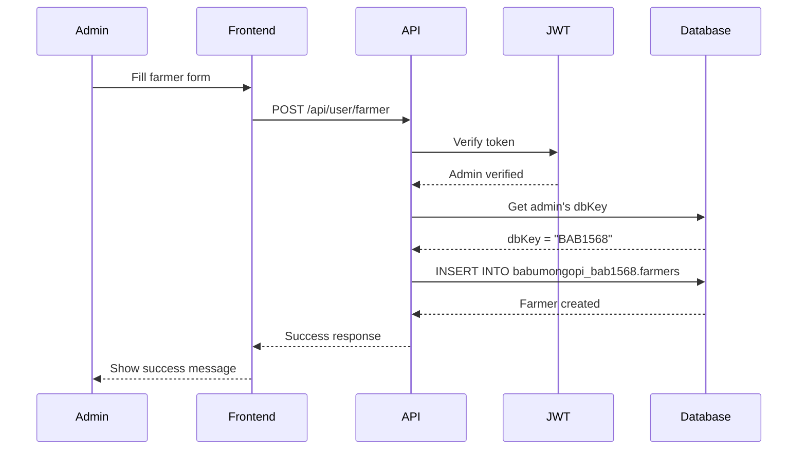
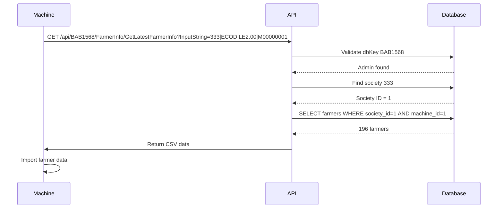
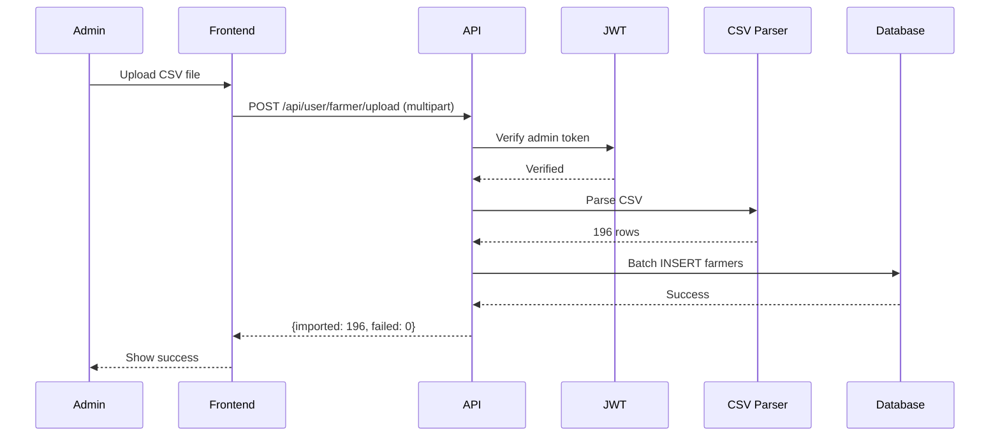

# Farmer Management System - Complete Documentation

## 📋 Table of Contents
1. [System Overview](#system-overview)
2. [Database Schema](#database-schema)
3. [API Endpoints](#api-endpoints)
4. [External APIs](#external-apis)
5. [Data Flow](#data-flow)
6. [Usage Examples](#usage-examples)

---

## 🎯 System Overview

The Farmer Management System is a comprehensive solution for managing dairy farmers, their information, and integration with milk testing machines.

### Key Features
- ✅ Farmer CRUD operations
- ✅ CSV bulk upload/download
- ✅ External API for machine integration
- ✅ Society and Machine association
- ✅ Status management (active, inactive, maintenance, suspended)
- ✅ Pagination support
- ✅ Bank account integration
- ✅ SMS notification preferences

### Tech Stack
- **Frontend**: Next.js 15, React 19, TypeScript
- **Backend**: Next.js API Routes
- **Database**: MySQL (Admin-specific schemas)
- **Authentication**: JWT tokens

---

## 🗄️ Database Schema

### Farmers Table
Location: `{adminname}_{dbkey}.farmers`

```sql
CREATE TABLE farmers (
  id INT PRIMARY KEY AUTO_INCREMENT,
  farmer_id VARCHAR(50) UNIQUE NOT NULL,
  rf_id VARCHAR(50),
  name VARCHAR(255) NOT NULL,
  password VARCHAR(255),
  phone VARCHAR(20),
  sms_enabled ENUM('ON', 'OFF') DEFAULT 'OFF',
  bonus DECIMAL(10,2) DEFAULT 0.00,
  address TEXT,
  bank_name VARCHAR(255),
  bank_account_number VARCHAR(50),
  ifsc_code VARCHAR(20),
  society_id INT,
  machine_id INT,
  status ENUM('active', 'inactive', 'maintenance', 'suspended') DEFAULT 'active',
  notes TEXT,
  cattle_count INT DEFAULT 0,
  created_at TIMESTAMP DEFAULT CURRENT_TIMESTAMP,
  updated_at TIMESTAMP DEFAULT CURRENT_TIMESTAMP ON UPDATE CURRENT_TIMESTAMP,
  FOREIGN KEY (society_id) REFERENCES societies(id),
  FOREIGN KEY (machine_id) REFERENCES machines(id)
);
```

### Field Descriptions

| Field | Type | Required | Description |
|-------|------|----------|-------------|
| `id` | INT | Yes | Auto-increment primary key |
| `farmer_id` | VARCHAR(50) | Yes | Unique farmer identifier (e.g., "F001") |
| `rf_id` | VARCHAR(50) | No | RFID card number |
| `name` | VARCHAR(255) | Yes | Farmer's full name |
| `password` | VARCHAR(255) | No | Password for machine login |
| `phone` | VARCHAR(20) | No | Contact number |
| `sms_enabled` | ENUM | Yes | SMS notification preference (ON/OFF) |
| `bonus` | DECIMAL(10,2) | Yes | Bonus amount (default 0.00) |
| `address` | TEXT | No | Physical address |
| `bank_name` | VARCHAR(255) | No | Bank name |
| `bank_account_number` | VARCHAR(50) | No | Bank account number |
| `ifsc_code` | VARCHAR(20) | No | Bank IFSC code |
| `society_id` | INT | No | Associated society (FK) |
| `machine_id` | INT | No | Associated machine (FK) |
| `status` | ENUM | Yes | active, inactive, maintenance, suspended |
| `notes` | TEXT | No | Additional notes |
| `cattle_count` | INT | Yes | Number of cattle owned |

---

## 🔌 API Endpoints

### 1. Admin Farmer APIs
**Base Path**: `/api/user/farmer`
**Authentication**: Required (JWT Token, Admin role)

#### GET /api/user/farmer
Retrieve farmers from admin's schema

**Query Parameters:**
- `id` (optional): Specific farmer ID

**Response:**
```json
{
  "success": true,
  "message": "Farmers retrieved successfully",
  "data": [
    {
      "id": 1,
      "farmerId": "F001",
      "rfId": "1234567890",
      "farmerName": "John Doe",
      "contactNumber": "+919876543210",
      "smsEnabled": "ON",
      "bonus": 5.00,
      "address": "123 Main St",
      "bankName": "State Bank",
      "bankAccountNumber": "1234567890",
      "ifscCode": "SBIN0001234",
      "societyId": 1,
      "societyName": "Dairy Society 1",
      "societyIdentifier": "S-333",
      "machineId": 1,
      "machineName": "M00000001",
      "machineType": "ECOD",
      "status": "active",
      "notes": "Premium farmer",
      "cattleCount": 5,
      "createdAt": "2025-01-01T00:00:00.000Z",
      "updatedAt": "2025-01-01T00:00:00.000Z"
    }
  ]
}
```

#### POST /api/user/farmer
Create new farmer or bulk upload

**Single Farmer:**
```json
{
  "farmerId": "F001",
  "rfId": "1234567890",
  "farmerName": "John Doe",
  "password": "secure123",
  "contactNumber": "+919876543210",
  "smsEnabled": "ON",
  "bonus": 5.00,
  "address": "123 Main St",
  "bankName": "State Bank",
  "bankAccountNumber": "1234567890",
  "ifscCode": "SBIN0001234",
  "societyId": 1,
  "machineId": 1,
  "status": "active",
  "notes": "Premium farmer"
}
```

**Bulk Upload:**
```json
{
  "farmers": [
    {
      "farmerId": "F001",
      "farmerName": "John Doe",
      "contactNumber": "+919876543210"
    },
    {
      "farmerId": "F002",
      "farmerName": "Jane Smith",
      "contactNumber": "+919876543211"
    }
  ]
}
```

**Response:**
```json
{
  "success": true,
  "message": "Farmer created successfully",
  "data": {
    "id": 1,
    "farmerId": "F001",
    "farmerName": "John Doe"
  }
}
```

#### PUT /api/user/farmer
Update existing farmer

**Request:**
```json
{
  "id": 1,
  "farmerId": "F001",
  "farmerName": "John Doe Updated",
  "status": "inactive"
}
```

#### DELETE /api/user/farmer
Delete farmer

**Query Parameters:**
- `id` (required): Farmer ID to delete

**Response:**
```json
{
  "success": true,
  "message": "Farmer deleted successfully"
}
```

### 2. CSV Upload API
**Path**: `/api/user/farmer/upload`
**Method**: POST
**Content-Type**: multipart/form-data

**Request:**
```
POST /api/user/farmer/upload
Content-Type: multipart/form-data

file: farmers.csv
```

**CSV Format:**
```csv
farmer_id,rf_id,name,phone,sms_enabled,bonus,address,bank_name,bank_account_number,ifsc_code,society_id,machine_id,status
F001,1234567890,John Doe,+919876543210,ON,5.00,123 Main St,State Bank,1234567890,SBIN0001234,1,1,active
F002,0987654321,Jane Smith,+919876543211,OFF,3.00,456 Oak Ave,HDFC Bank,0987654321,HDFC0001234,1,1,active
```

**Response:**
```json
{
  "success": true,
  "message": "Farmers uploaded successfully",
  "data": {
    "imported": 196,
    "failed": 0,
    "errors": []
  }
}
```

---

## 🌐 External APIs

### 1. Get Farmer Info API
**Path**: `/api/[db-key]/FarmerInfo/GetLatestFarmerInfo`
**Methods**: GET, POST
**Authentication**: None (Uses db-key validation)

#### Purpose
External API for milk testing machines to download farmer information.

#### Request Formats

**GET Request:**
```
GET /api/BAB1568/FarmerInfo/GetLatestFarmerInfo?InputString=333|ECOD|LE2.00|M00000001
GET /api/BAB1568/FarmerInfo/GetLatestFarmerInfo?InputString=333|ECOD|LE2.00|M00000001|C00001
```

**POST Request:**
```json
POST /api/BAB1568/FarmerInfo/GetLatestFarmerInfo
Content-Type: application/json

{
  "InputString": "333|ECOD|LE2.00|M00000001"
}
```

#### InputString Format

**CSV Download (4 parts):**
```
societyId|machineType|version|machineId
```
Example: `333|ECOD|LE2.00|M00000001`

**Paginated Request (5 parts):**
```
societyId|machineType|version|machineId|pageNumber
```
Example: `333|ECOD|LE2.00|M00000001|C00001`

#### InputString Components

| Component | Position | Description | Example |
|-----------|----------|-------------|---------|
| **societyId** | 1 | Society identifier (with or without S- prefix) | `333` or `S-333` |
| **machineType** | 2 | Machine type/model | `ECOD` |
| **version** | 3 | Machine firmware version | `LE2.00` |
| **machineId** | 4 | Machine identifier (must start with M) | `M00000001` |
| **pageNumber** | 5 (optional) | Page number for pagination (format: C00001) | `C00001` |

#### Response Formats

**CSV Download Response:**
```csv
RF-ID,ID,NAME,MOBILE,SMS,BONUS
1234567890,F001,John Doe,+919876543210,ON,5
0987654321,F002,Jane Smith,+919876543211,OFF,3
```

**Headers:**
- `Content-Type: text/csv`
- `Content-Disposition: attachment; filename="FarmerDetails.csv"`

**Paginated Response:**
```
"F001|1234567890|John Doe|+919876543210|ON|5.00||F002|0987654321|Jane Smith|+919876543211|OFF|3.00"
```

Format: `farmerId|rfId|name|phone|smsEnabled|bonus||` (double pipes separate records)

**Error Responses:**
```
"Invalid DB Key"
"Failed to download farmer. Invalid token."
"Failed to download farmer. Invalid machine details."
"Farmer info not found."
```

#### Validation Rules

1. **DB Key Validation**
   - Must exist in main `users` table
   - Must be associated with an admin account

2. **Society ID Validation**
   - Must exist in `{schema}.societies` table
   - Accepts both formats: `333` and `S-333`

3. **Machine ID Validation**
   - Must start with 'M'
   - Can be numeric: `M00000001` → extracts `1`
   - Can be alphanumeric: `MABC123` → uses `ABC123`
   - Handles zero-padding automatically

4. **Status Filter**
   - Only returns farmers with `status = 'active'`

#### Pagination

- **Page Size**: Fixed at 5 farmers per page
- **Page Numbers**: Encoded as `C00001` (page 1), `C00002` (page 2), etc.
- **Offset Calculation**: `(pageNumber - 1) * 5`

---

## 🔄 Data Flow

### 1. Admin Creating Farmers



### 2. Machine Downloading Farmer Data



### 3. CSV Bulk Upload



---

## 💡 Usage Examples

### Example 1: Create Single Farmer

```typescript
const createFarmer = async () => {
  const response = await fetch('/api/user/farmer', {
    method: 'POST',
    headers: {
      'Content-Type': 'application/json',
      'Authorization': `Bearer ${token}`
    },
    body: JSON.stringify({
      farmerId: 'F001',
      farmerName: 'John Doe',
      contactNumber: '+919876543210',
      smsEnabled: 'ON',
      societyId: 1,
      machineId: 1,
      status: 'active'
    })
  });

  const data = await response.json();
  console.log(data);
};
```

### Example 2: Get All Farmers

```typescript
const getFarmers = async () => {
  const response = await fetch('/api/user/farmer', {
    method: 'GET',
    headers: {
      'Authorization': `Bearer ${token}`
    }
  });

  const data = await response.json();
  console.log(`Total farmers: ${data.data.length}`);
};
```

### Example 3: External API - CSV Download

```bash
curl -X GET "http://168.231.121.19/api/BAB1568/FarmerInfo/GetLatestFarmerInfo?InputString=333|ECOD|LE2.00|M00000001"
```

### Example 4: External API - Paginated Request

```bash
curl -X POST "http://168.231.121.19/api/BAB1568/FarmerInfo/GetLatestFarmerInfo" \
  -H "Content-Type: application/json" \
  -d '{"InputString": "333|ECOD|LE2.00|M00000001|C00001"}'
```

### Example 5: CSV Upload

```typescript
const uploadCSV = async (file: File) => {
  const formData = new FormData();
  formData.append('file', file);

  const response = await fetch('/api/user/farmer/upload', {
    method: 'POST',
    headers: {
      'Authorization': `Bearer ${token}`
    },
    body: formData
  });

  const data = await response.json();
  console.log(`Imported: ${data.data.imported}, Failed: ${data.data.failed}`);
};
```

---

## 🔒 Security

### Authentication
- Admin APIs require JWT token with `role === 'admin'`
- External APIs use DB Key validation instead of JWT

### Authorization
- Farmers are scoped to admin's schema
- Admins can only access their own farmers
- Schema name format: `{adminname}_{dbkey}`

### Input Validation
- Society ID format validation
- Machine ID format validation (must start with 'M')
- CSV parsing with error handling
- SQL injection prevention through parameterized queries

---

## 🐛 Error Handling

### Common Errors

| Error | HTTP Status | Cause | Solution |
|-------|-------------|-------|----------|
| `Authentication required` | 401 | Missing JWT token | Add Authorization header |
| `Admin access required` | 403 | Non-admin user | Use admin account |
| `Invalid DB Key` | 404 | DB Key not found | Verify dbKey exists |
| `Invalid InputString format` | 400 | Wrong InputString parts | Check format: `society|type|version|machine` |
| `Invalid machine details` | 400 | Machine ID invalid | Must start with 'M' |
| `Farmer info not found` | 200 | No active farmers | Check society/machine IDs |

---

## 📊 Performance Considerations

### Database Indexes
```sql
CREATE INDEX idx_farmer_id ON farmers(farmer_id);
CREATE INDEX idx_society_id ON farmers(society_id);
CREATE INDEX idx_machine_id ON farmers(machine_id);
CREATE INDEX idx_status ON farmers(status);
CREATE INDEX idx_created_at ON farmers(created_at);
```

### Optimization Tips
- Use pagination for large datasets
- Filter by status='active' to reduce results
- Batch operations for bulk uploads
- Connection pooling for database

---

## 🔮 Future Enhancements

1. **Real-time Sync**: WebSocket for live farmer updates
2. **Analytics**: Farmer statistics and reports
3. **Mobile App**: Farmer mobile application
4. **QR Codes**: QR code generation for quick farmer lookup
5. **Audit Logs**: Track all farmer changes
6. **Advanced Filters**: Filter by bonus, cattle count, etc.
7. **Export Options**: PDF, Excel export formats

---

## 📞 Support

For issues or questions:
- Check logs: `/var/www/psr-v4/logs`
- PM2 logs: `pm2 logs psr-v4`
- Database logs: `sudo tail -f /var/log/mysql/error.log`

**Documentation Version**: 1.0.0
**Last Updated**: November 7, 2025
